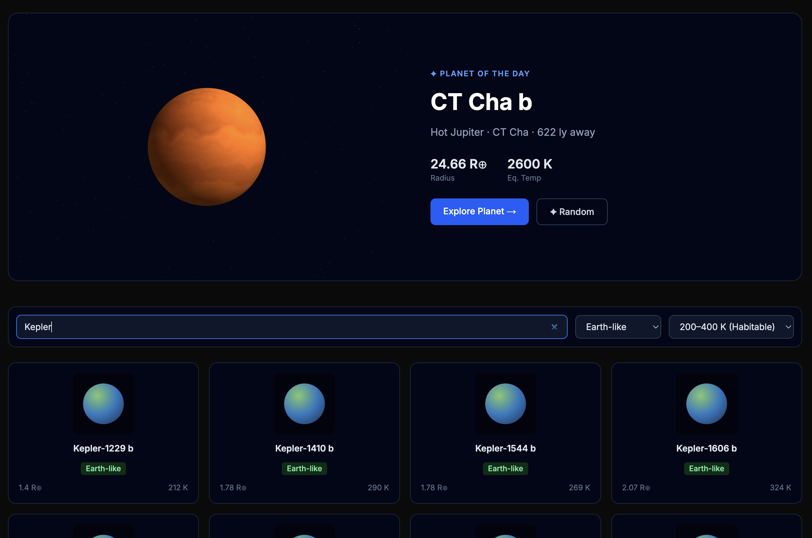
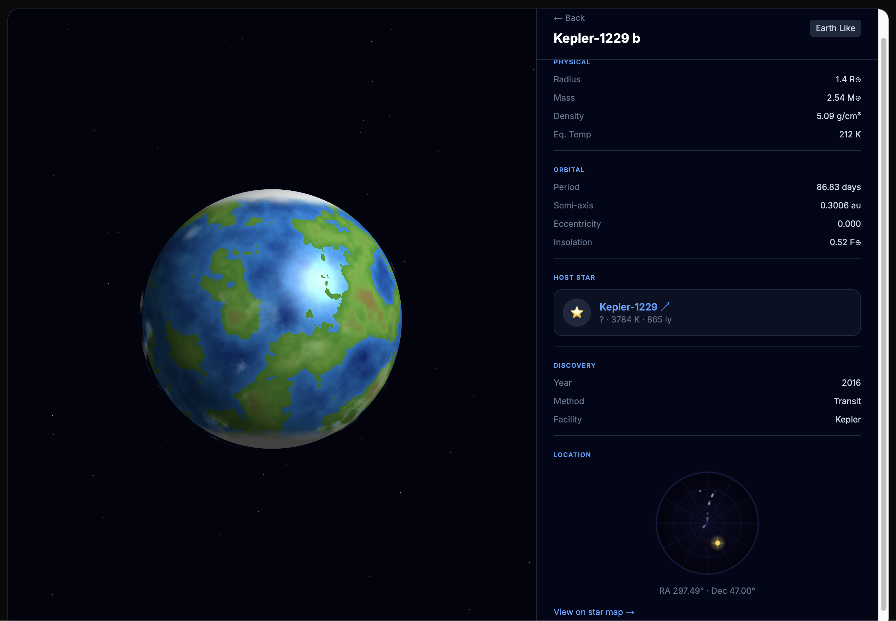
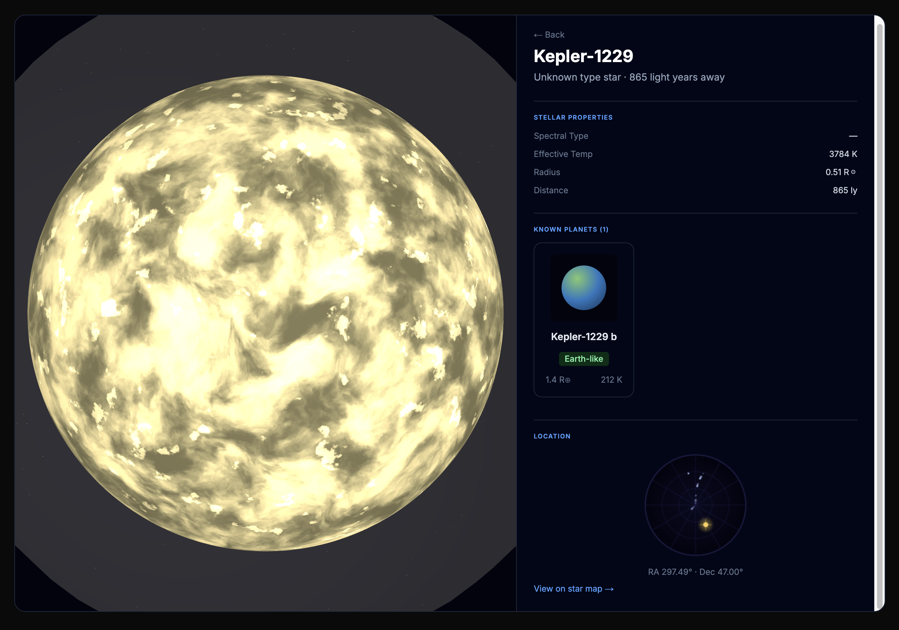
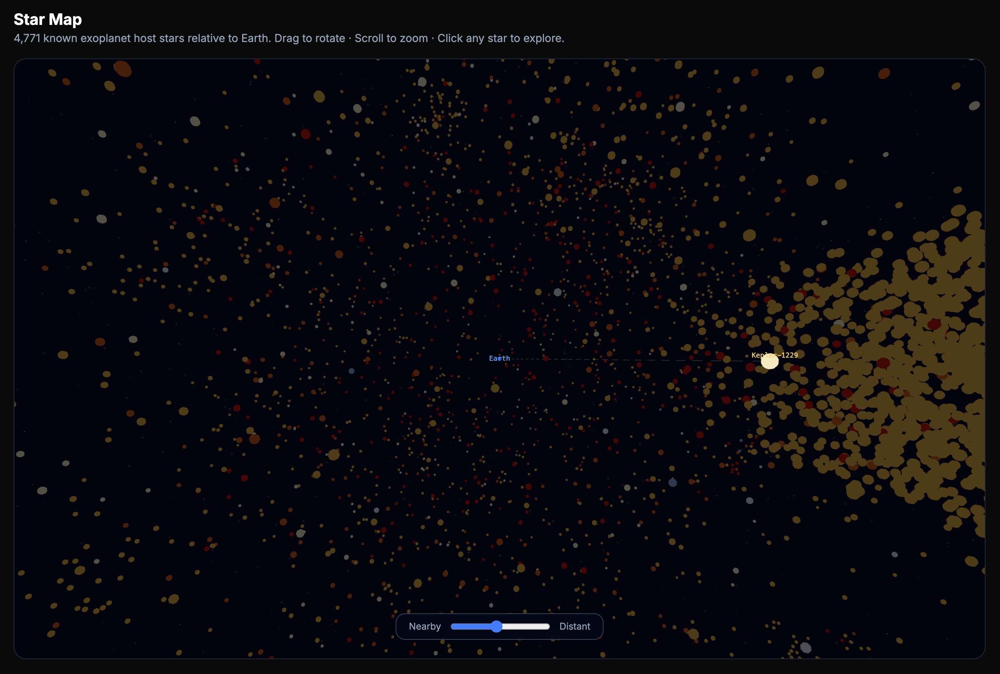

# Exoplanets

A Next.js app that pulls confirmed exoplanet data from the [NASA Exoplanet Archive](https://exoplanetarchive.ipac.caltech.edu/) and renders each planet as a realistic, data-driven 3D model. Browse thousands of known exoplanets, explore individual planet and star systems, and navigate an interactive 3D star neighborhood map.

## Features

- **Landing page** — rotating "planet of the day" hero + filterable/paginated planet grid
- **Planet detail** — large 3D viewer with custom GLSL shaders per planet type, grouped stats panel, host star card, and sky chart widget
- **Star detail** — 3D star render with corona glow, stellar properties, and scrollable planet list
- **Star map** — interactive 3D scatter plot of all known host stars relative to Earth, with log-scale distance slider

### Planet types rendered

| Type | Visual style |
|---|---|
| Rocky | FBM terrain, craters, ice caps / lava cracks based on temperature |
| Gas Giant | Horizontal bands, turbulence, procedural storm spot |
| Hot Jupiter | Heat gradient, dayside glow, ablation rim |
| Ocean World | Ocean specular, polar ice caps, animated surface chop |
| Earth-like | Continent/ocean FBM, biome elevation tinting, polar ice |
| Sub-Neptune | Neptune-blue banding, haze atmosphere layer |

All visuals are procedural (no image textures). Each planet's appearance is deterministic — seeded from its name via djb2 hash so it always looks the same across visits.

## Screenshots

<table>
  <tr>
    <td align="center"><br/><sub>Search &amp; filter planets</sub></td>
    <td align="center"><br/><sub>Planet detail — 3D viewer &amp; stats</sub></td>
  </tr>
  <tr>
    <td align="center"><br/><sub>Host star — plasma surface &amp; system info</sub></td>
    <td align="center"><br/><sub>Interactive 3D star map</sub></td>
  </tr>
</table>

## Running locally

**Prerequisites:** Node.js 18+

```bash
npm install
npm run dev
```

Open [http://localhost:3000](http://localhost:3000).

No API keys or environment variables required — data is fetched live from the NASA Exoplanet Archive TAP API at request time and cached by Next.js for 1 hour.

## Other commands

```bash
npm run build   # production build + type check
npm test        # Jest test suite
npm run lint    # ESLint
```

## Routes

| Route | Description |
|---|---|
| `/` | Landing page — hero planet + browsable grid |
| `/planet/[name]` | Planet detail — 3D viewer + stats |
| `/star/[name]` | Star detail — 3D star + system info |
| `/map` | Interactive 3D star neighborhood |

## Stack

- **Next.js 15** (App Router) — Server Components for all data fetching
- **react-three-fiber** + **@react-three/drei** — Three.js in React
- **Custom GLSL shaders** — one per planet type, procedurally generated
- **NASA Exoplanet Archive TAP API** — `pscomppars` table (one best row per planet)
- **Tailwind CSS**, **TypeScript**, **Jest**
